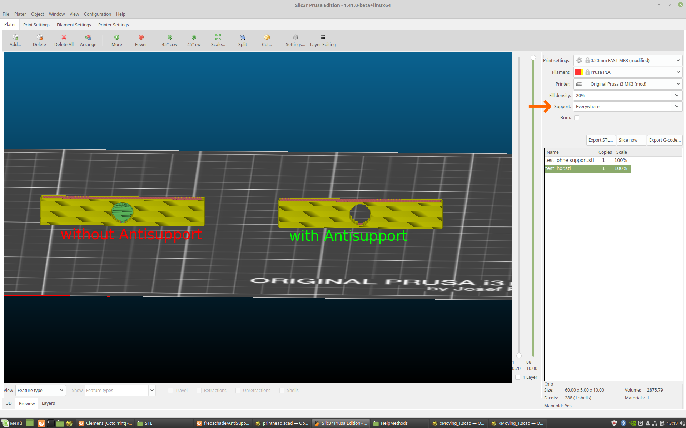

AntiSupport
===========
In the current version of Slic3r, only three different types of support can be selected. 
Either "Everywhere", "Support on build plate only" or "None". However, if you only want support material in certain places, 
there is no choice for it. For this I developed AntiSupport. It is a small OpenScad help file, with which you can define 
the support free areas. (see the picture)
*How do us it is explained in the file.

